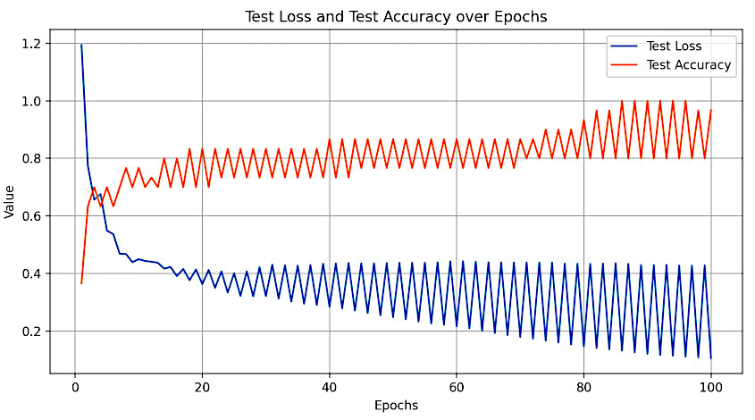

## Teaching Neural Networks: Backpropagation

Let's start by thinking about how we teach a computer to recognize objects in pictures.  To train a neural network, we need to give it lots of examples of pictures and tell it what object is in each picture. The network looks at the picture and makes a guess about what object it might be, and then we tell it whether it was right or wrong. If it was wrong, we need to adjust the network's parameters (like the knobs on a stereo) so that it does better next time.

**Backpropagation** is the algorithm that we use to adjust the network's parameters based on whether it was right or wrong.

* We give the neural network a picture and it makes a guess about what object is in the picture.
* We compare the network's guess to the correct answer and calculate how far off it was. This is like measuring the distance between where the network was and where it should have been.
* We use the distance to figure out how much each parameter in the network needs to change to make the network do better next time. This is like turning the knobs on a stereo to make the music sound better.
* We update the parameters and give the network another picture to guess on.
* We repeat this process for lots and lots of pictures, and over time the network gets better and better at recognizing objects in pictures. It's like a student who practices doing math problems until they get better at it.

## TensorFlow

Yes, TensorFlow includes automatic differentiation and optimization algorithms that can **perform backpropagation for you**. So you don't have to implement the backpropagation algorithm yourself.

Create a simple neural network and train it on a dataset using the backpropagation algorithm:

```py
import tensorflow as tf
from sklearn.datasets import load_iris
from sklearn.model_selection import train_test_split

# Load the Iris dataset
iris = load_iris()
X, y = iris.data, iris.target

# Convert target values to one-hot encoded format
y = tf.keras.utils.to_categorical(y, num_classes=3)

# Split the dataset into training and testing sets
X_train, X_test, y_train, y_test = train_test_split(X, y, test_size=0.2, random_state=42)

# Define your model and loss function

# Define the neural network architecture
model = tf.keras.Sequential([# no flatten
    tf.keras.layers.Dense(16, activation='relu', input_shape=(4,)), tf.keras.layers.Dense(3, activation='softmax')])

# Define the loss function and optimization algorithm
loss_fn = tf.keras.losses.CategoricalCrossentropy()
optimizer = tf.keras.optimizers.SGD(learning_rate=0.1)

# Train the model
batch_size = 32
epochs = 100

# Lists to store test_loss and test_accuracy values
test_losses = []
test_accuracies = []

for epoch in range(epochs):
    # Floor division
    for batch in range(len(X_train) // batch_size):
        start = batch * batch_size
        end = start + batch_size
        x_batch = X_train[start:end]
        y_batch = y_train[start:end]

        with tf.GradientTape() as tape:
            y_pred = model(x_batch)
            loss = loss_fn(y_batch, y_pred)

        gradients = tape.gradient(loss, model.trainable_variables)
        optimizer.apply_gradients(zip(gradients, model.trainable_variables))

    # Evaluate the model on the test set
    y_pred = model(X_test)
    test_loss = loss_fn(y_test, y_pred)
    test_accuracy = tf.keras.metrics.CategoricalAccuracy()(y_test, y_pred)
    print(f'Epoch {epoch + 1}, loss={loss:.2f}, test_loss={test_loss:.2f}, test_accuracy={test_accuracy:.2f}')

    # Save test_loss and test_accuracy for plotting
    test_losses.append(test_loss.numpy())
    test_accuracies.append(test_accuracy.numpy())

import matplotlib.pyplot as plt

# Plot test_loss versus test_accuracy
epochs_range = range(1, epochs + 1)

plt.figure(figsize=(10, 5))
plt.plot(epochs_range, test_losses, label='Test Loss')
plt.plot(epochs_range, test_accuracies, label='Test Accuracy')
plt.xlabel('Epochs')
plt.ylabel('Value')
plt.legend()
plt.title('Test Loss and Test Accuracy over Epochs')
plt.grid(True)
plt.show()
```

<br>
This code defines a neural network with one hidden layer and an output layer.

It loads the Iris dataset, preprocesses the data, and trains the model using the backpropagation algorithm.

The training loop **updates the model parameters** using the gradients computed by `tf.GradientTape`, which automatically differentiates the loss function with respect to the model parameters.

The optimizer applies the computed gradients to the model parameters to update them.

The model is trained for 100 epochs.

For each epoch, the code evaluates the model on the test set and prints the training loss, test loss, and test accuracy.



<br>
