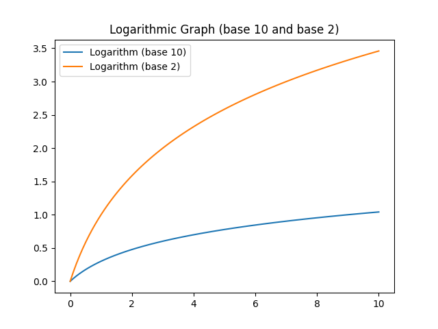
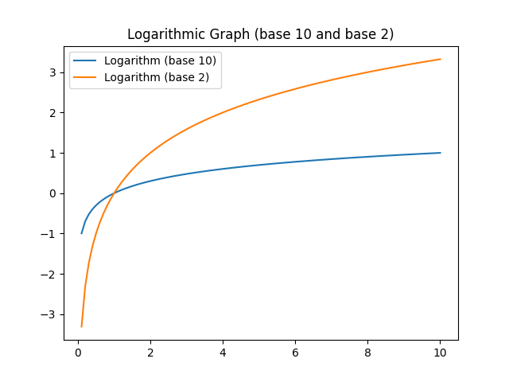

# 📊

One way to represent the concept of logarithm as an image is to use a graph with an x-axis and a y-axis.

The x-axis represents the input values, and the y-axis represents the logarithmic values.

The shape of the graph will depend on the base of the logarithm. 

A logarithmic graph with a base of 10 will have a curved shape.

A logarithmic graph with a base of 2 will have a steeper slope.



### Plot graph with base 10 and 2

```py
import matplotlib.pyplot as plt
import numpy as np

# Generate data
x = np.linspace(0, 10, 100)
y1 = np.log10(x + 1)
y2 = np.log2(x + 1)

# Plot data
plt.plot(x, y1, label='Logarithm (base 10)')
plt.plot(x, y2, label='Logarithm (base 2)')

# Add title and legend
plt.title('Logarithmic Graph (base 10 and base 2)')
plt.legend()

# Display the graph
plt.show()
```

In this example, we generate two sets of data `y1` and `y2` corresponding to the logarithmic values of `x` with base 10 and 2 respectively.

We then plot both sets of data on the same graph using `plt.plot()`, and add a title and legend using `plt.title()` and `plt.legend()`.

Finally, we display the graph using `plt.show()`.


### Element-wise Logarithm in Python

<span style="color:#000088;font-size:larger;">If we have a numpy.ndarray, "x", and we do numpy.log10(x + 1), does the x + 1 just mean "for every element in the array"?</span>

<span style="color:#000088;font-weight:bold;">Sort of.</span>

When you do `numpy.log10(x + 1)`, `x + 1` is performed element-wise on the array `x`.

This means that the `+ 1` operation is applied to each element of the array individually, adding 1 to each value in `x`.

Then, the resulting array `x + 1` is passed as the input to the `numpy.log10` function, which computes the base-10 logarithm of each element in the array `x + 1`.

The resulting array will have the same "shape" as the original x array, but each element will be the logarithm of the corresponding element in `x + 1`.

Note that adding 1 to `x` before taking the logarithm

is a common technique used to avoid taking the logarithm of **zero** or **negative** values, 

since `log10(0)` and `log10(negative value)` are undefined.

<span style="color:#0000dd;font-size:larger;">That's how we end up starting at 0.</span>

Because the first number array x is 0!

Since we can't do that *(it's like negative infinity)*, we add 1.

**`np.log10(1) = 0.0`**

So then we end up with both arrays starting with zero. \\^o^/


### I got it!

<span style="color:#000088;font-size:larger;">It's element-wise, so we add 1 to each element of array x, and then take the log of that.</span>

<span style="color:#000088;">So yes, we do it for each element in the array; but we're also adding 1 to each element of the array...</span>

At first, I thought that was stupid (adding 1 to every number), but then I did this - 

If we just do <b>log<sub>n</sub>(x)</b> *(not x + 1)*, we get this:

```py
y1 = np.log10(x)
y2 = np.log2(x)
```



The 2 got flatter, and the 10 was already flat.

But they're not both starting from 0 anymore.  They're starting from -3(ish) and -1.

Which is the graph I started out with to begin with. ^_^


<br>
