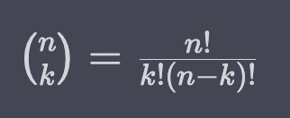
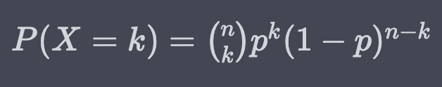

### Is the "binomial coefficient" the same as "binomial distribution"?

No, the "binomial coefficient" and "binomial distribution" are not the same thing.

The **binomial coefficient**, denoted by:

`${n \choose k}$`

or

`$\binom{n}{k}$`

represents the **number of ways to choose k objects** from a set of n distinct objects, without regard to their order. It is calculated as:

​


The **binomial distribution**, on the other hand, is a probability distribution that describes the **number of successes** in a fixed number of independent trials, each with the same probability of success.

It is characterized by two parameters: the number of trials (n) and the probability of success on each trial (p). 

The probability of getting exactly k successes in n trials is given by the binomial probability mass function:



So while both concepts involve **binomial** terms, they refer to different mathematical ideas: the binomial coefficient counts **combinations**, while the binomial distribution models **probabilities** of outcomes in a series of trials.

### Denotations

Okay, so those denotations `${n \choose k}$`... where are they used?  On paper?  In a command line calculation?  What?

The denotations ${n \choose k}$ or $\binom{n}{k}$ are commonly used to represent binomial coefficients in mathematical notation, such as in textbooks, research papers, and other written materials.

### Binomial

An algebraic expression of the sum or the difference of two terms.

## Python

You can use the `math` library to calculate binomial coefficients using the `comb()` function...

```python
import math

# Calculate binomial coefficient of 5 choose 2
n = 5
k = 2
coef = math.comb(n, k)

print(coef)  # Output: 10
```

Note that the `math.comb()` function was added in Python 3.8. If you are using an older version of Python, you can use the `scipy.special.comb()` function from the `scipy` library instead...

```python
from scipy.special import comb

# Calculate binomial coefficient of 5 choose 2
n = 5
k = 2
coef = comb(n, k)

print(coef)  # Output: 10.0
```

<br>
