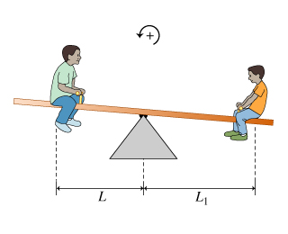

## Harmonic mean ⚖️ 

<!-- If you were to express "harmonic mean" as a picture, or an image, what would it be? -->

To get them to balance, we could either add more weight, or torque...



or move the fulcrum:


### What is the "harmonic mean"?

<!-- A type of average that emphasizes small values. -->

The harmonic mean is a type of average that is used to calculate a central or representative value for a set of numbers. It is calculated by dividing the number of values in the set by the sum of the reciprocal of each value in the set.

<span style="color:green;font-weight:bold;">Don't worry; there's a code sample, below.</span>

The reciprocal of a number is simply 1 divided by the number. For example, the reciprocal of 4 is 1/4, and the reciprocal of 5 is 1/5. To calculate the harmonic mean of a set of numbers, we first calculate the reciprocal of each number, then we take the sum of those reciprocals, and finally we divide the number of values in the set by the sum of the reciprocals.

The harmonic mean is often used to calculate averages for rates or ratios, such as the average speed of a journey or the average price-to-earnings ratio of a stock market index. The harmonic mean is generally less affected by extreme values than other types of averages, such as the arithmetic mean or the geometric mean.

### Calculate

To calculate the harmonic mean of a set of numbers:

1. Calculate the reciprocal of each number
2. Take the sum of those reciprocals
3. Divide the number of values in the set by the sum of the reciprocals.

```py
# Calculate the harmonic mean of
numbers = [10, 5]
# numbers = [2, 4, 6, 8]

# Calculate the reciprocal of each number
reciprocals = [1/x for x in numbers]

# Calculate the average of the reciprocals
average = sum(reciprocals) / len(reciprocals)

# Take the reciprocal of the average
harmonic_mean = 1 / average

# Print the result
print("The harmonic mean is:", harmonic_mean)

# The harmonic mean of 10 and 5 is 6.67
# The harmonic mean of 2, 4, 6, and 8 is 3.84
```

<br>

In this example, the reciprocal of each number is calculated using a list comprehension, which is a way to create a new list by applying an operation to each element of an existing list.

The `sum()` function is used to find the sum of the reciprocals, and the `len()` function is used to find the number of reciprocals in the list.

The average is then calculated by dividing the sum by the number of elements in the list.

Finally, the reciprocal of the average is taken to find the harmonic mean.

This is because the harmonic mean is the reciprocal of the arithmetic mean of the reciprocals.

### Find the average of rates or ratios

Harmonic mean is useful for averaging rates or ratios, like speed or fuel efficiency.

It is generally less affected by extreme values than other types of averages, such as the arithmetic mean or the geometric mean.

For example, the harmonic mean could be used to find the average speed of a car over a journey with varying speeds.

In this case, the speeds are continuous variables.

But the harmonic mean could also be used to find the average price-to-earnings ratio of a set of stocks, which is a discrete variable.

However! For data with outliers, the harmonic mean can be strongly influenced by them and 

may not provide a representative measure of the central tendency.

In such cases, other measures like the arithmetic mean or median may be more appropriate.

## Regular mean

### Get average of list

```py
def Average(lst):
	return sum(lst) / len(lst)

lst = [15, 9, 55, 41, 35, 20, 62, 49]
average = Average(lst)

print("Average of the list =", round(average, 2))
# 35.75
# Harmonic mean is 23.84 ;)
```

<br>
