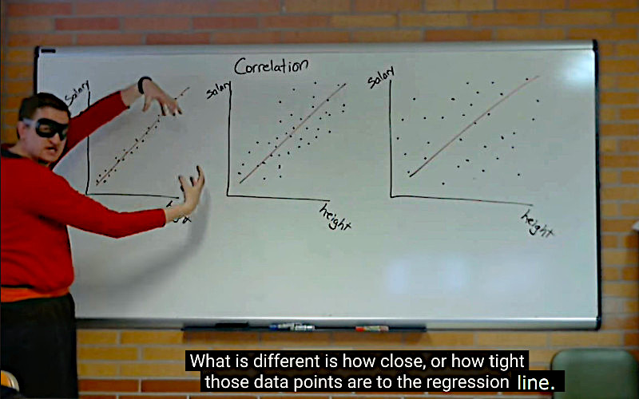
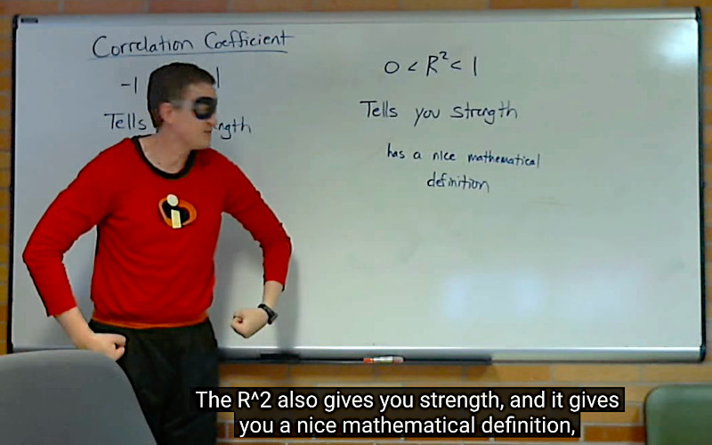

## Regular R = correlation

Correlation values close to 1 or -1 are good.

It tells you two quantitative values (e.g. weight and size) are strongly related.

Correlation values close to 0 are [lame](https://youtu.be/bMccdk8EdGo) (weak relation).

[Correlation Coefficient](https://youtu.be/FbyG7QgqWIo) -1 < R < 1; **(R) ranges between -1 and 1.**

Correlation tells you strength, and direction.

For example: -1 is downward sloping, and in a straight line.

Which of these 3 pictures is most disturbing?  I think we would agree on the 1st one.  Because here the data points are really closely following the line.

## R-squared = fit; strength

The R-squared value is a measure of how well a line or curve fits the data points.

Also called the "coefficient of determination", but nobody ever uses its name, [so let's skip it](https://youtu.be/FbyG7QgqWIo?t=208).

The R-squared value is like a "score" that tells us how well a line or curve fits a set of data points. It's kind of like a report card for the line or curve.

Imagine you're trying to draw a line through a bunch of dots on a graph. You want the line to go through as many dots as possible, but you also want it to be as close as possible to all the dots. The R-squared value tells you how close the line is to the dots.

The R-squared value is a number between 0 and 1, and it tells you what percentage of the variation in the data is explained by the line or curve you drew. So, if the R-squared value is 0.8, that means that 80% of the variation in the data is explained by the line you drew, and 20% is not explained by the line.

### Variance = variability

Variance is a statistical measure of how spread out a set of data is, or how much the data varies from the average or mean value.

### Height and Weight

If the R-squared value is high, it means that weight is a good predictor of height, and there is a strong relationship between the two variables.

If the R-squared value is low, it means that weight is not a good predictor of height, and there is little to no relationship between the two variables.

In machine learning, the R-squared value is often used as a metric to evaluate how well a regression model fits the data.

A value close to 1 indicates a good fit, while a value close to 0 indicates a poor fit.

 
