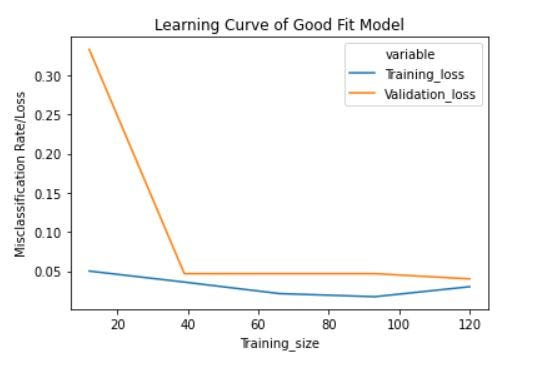

## Evaluate Model After Training

I've seen people evaluate their TensorFlow model before training it.  Wouldn't we want to evaluate it after training?  (Like, duh.)

It is not advisable to evaluate a TensorFlow model before training it because:

1. The **weights** of the model are randomly initialized at the beginning of the training process
2. The model has not yet **learned** anything from the training data.

During training, the model learns from the data and updates its weights to improve its performance on the task at hand. 

Therefore, evaluating the model before training would give you **random predictions** that are not representative of the model's actual performance.

It is important to evaluate the model after training to assess its performance and determine if it is meeting the desired accuracy and other metrics. This evaluation will help you fine-tune the model and improve its performance if necessary.

In summary, it is advisable to evaluate the TensorFlow model after training it, not before.

## Good fit model

The validation catches up with the training.

## Underfit

Both loss curves slope downward.

An underfit model that does not have sufficient capacity will be one parallel line at the top, and one at the bottom.

## Overfit

If the validation loss initially decreases and then starts to increase after a certain number of epochs, it is a sign of overfitting.

Overfitting occurs when a model becomes **too complex** and starts to **memorize** the training data **instead of learning** the underlying patterns that generalize to new, unseen data.

When the model overfits, it performs well on the training data but poorly on the validation data.

The validation loss initially decreases because the model is learning the underlying patterns in the training data.

However, after a certain point, the model starts to memorize the training data and becomes too specialized to generalize well to new data, causing the validation loss to start increasing.

## Fix

To address this issue, you can try the following techniques:

1. Use **regularization** techniques such as **dropout** or L1/L2 regularization to reduce the complexity of the model and prevent overfitting.

2. Use **early stopping** to stop the training process when the validation loss stops improving.

3. **Increase the size of the validation set** to get a better estimate of the model's performance on unseen data.

4. **Reduce the learning rate** of the optimizer to slow down the rate at which the model learns from the training data.

5. Try different architectures or hyperparameters to find the optimal configuration that balances the model's complexity and performance.

In summary, if the validation loss starts to increase after a certain number of epochs, it is a sign of overfitting, and you need to take steps to address this issue to improve the model's performance on new data.

## Training loss zero

If the training loss goes down and stabilizes at zero while the validation loss initially decreases and then starts to increase, it is a sign that the model is overfitting to the training data.

When the training loss goes down to zero, it means that the model has **learned to perfectly fit** the training data, which is good. However, this does not necessarily mean that the model can generalize well to new, unseen data.

If the validation loss starts to increase, it means that the model is **starting to memorize** the training data instead of learning the underlying patterns that generalize to new data, causing the model to overfit.

To address this issue, you can try the techniques mentioned earlier, such as regularization, early stopping, and hyperparameter tuning. You may also want to consider increasing the size of the validation set or using cross-validation to get a better estimate of the model's performance on unseen data.

## Plot accuracy

It is quite common for the training accuracy to be **higher** than the validation accuracy because the model is optimized to fit the training data. 🤦🏻‍♀️ Duh.

The goal of training a machine learning model is to achieve good generalization performance on new, unseen data. Therefore, the validation accuracy is a more important metric to monitor than the training accuracy.

Ideally, both the training and validation accuracy should increase as the model is trained

But the rate of increase in the validation accuracy may slow down or plateau at some point. This is because the model may start to overfit the training data as it becomes more complex, causing the validation accuracy to stop improving.

In summary, while it is not necessary for the validation accuracy to be above the training accuracy, **it is more important to focus on improving the validation accuracy** to achieve good generalization performance on new data.

<!-- https://miro.medium.com/v2/resize:fit:2000/format:webp/1*pXJJTOS0f0dqgnlleP10aA.jpeg -->

<!-- https://miro.medium.com/v2/resize:fit:1400/format:webp/1*UCd6KrmBxpzUpWt3bnoKEA.png -->

 
