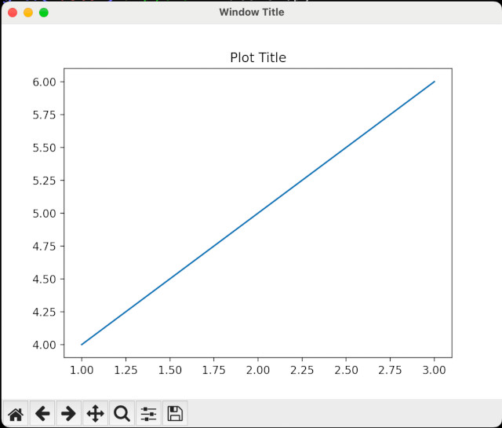

## Window Title

You can change the title of a matplotlib figure window by using `set_window_title()` (otherwise, it'll say "Figure 1").



### Example

```python
import matplotlib.pyplot as plt

# create a plot
plt.plot([1, 2, 3], [4, 5, 6])

# set the title of the figure window
plt.gcf().canvas.manager.set_window_title('My Custom Title')

# display the plot
plt.show()
```

<br>

```c
figure = plt.gcf()
```

<br>

`plt.gcf()` returns the current figure object.

`canvas.manager.set_window_title(...)` sets the title of the figure window to "My Custom Title".

Note that this method sets the title of the window itself, not the title of the plot within the window. So...

## Plot Title

To set the title of the plot, it's just `plt.title()`

```python
import matplotlib.pyplot as plt

# create a plot
plt.plot([1, 2, 3], [4, 5, 6])

# set the title of the plot
plt.title('My Custom Title')

# display the plot
plt.show()
```

<br>
In this example, `plt.title()` sets the title of the plot itself to "My Custom Title".

<br>
