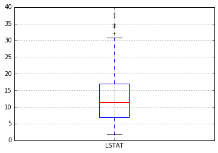

## Score distribution in 20 tests

How many students earned a score from 77 to 90?

The question provides the following information: 

1. The range of test scores is from 65 to 100.

2. There are 20 students; ergo 20 different test scores.

3. There is an equal number of test scores between the minimum and maximum.
   - There are an even number of data points.
   - The scores are distributed evenly.

4. No two students earned the same score.

My calculation goes like this...

The total difference in scores is `100 - 65 = 35`.

The difference in score for the 77 - 90 group is: `90 - 77 = 13` points.

Ratio of points times num students: `13/35 * 20` students = `7.42` students.

Since 7 isn't in the list of choices; I'll round up to **8**, and voilà.

## Henry went around the block a couple of times

We can infer that the scores are distributed evenly. The scores can thus be divided into two groups: scores from 65 to 77 and scores from 77 to 100.

I asked why those 2 groups, but he just recalculated it; see below.

The total difference in scores is `100 - 65 = 35`. 

The difference for each group would be:
1. Group 1: `77 - 65 = 12`
2. Group 2: `100 - 77 = 23`

Given that the scores are evenly distributed, the number of students in each group should be proportional to the difference in scores for each group. 

So, the number of students who scored from 65 to 77 would be:
`(12/35) * 20` = approximately `6.86`

Given that you can't have a fraction of a student, you'd **round down** to 6 students for the group 1.

Therefore, the remaining `20 - 6 = 14` students would have scored from 77 to 100.

However, you're asking for the students who scored from **77 to 90**, not up to 100. We have to make a similar calculation:

The difference between 77 and 90 is `13`. The difference between 77 and 100 is `23`. The proportion of students who scored between 77 and 90 compared to all students who scored between 77 and 100 would be `13/23`.

So, the number of students who scored from 77 to 90 would be approximately:

`(13/23) * 14` = approximately `7.96`

Given that you can't have a fraction of a student, you'd **round up** to 8 students. 

Therefore, based on the information provided and assuming an even distribution of scores, approximately **8 students** would have **scored from 77 to 90**.

## Henry's recalculation

The test scores range from 65 to 100, with no two students having the same score. This means there are `36` unique scores (`100 - 65 + 1 = 36`) possible.

But we know there are only `20` students, so only `20` out of these `36` scores are assigned. 

You're asking how many students earned a score from 77 to 90. The number of unique scores in this range is `90 - 77 + 1 = 14`.

Assuming a perfectly even distribution, the `20` students would be spread across these `36` possible scores. The probability of a student having a score within any given range should be proportional to the size of that range relative to the total range.

So, the number of students who scored from 77 to 90 would be approximately:

`(14/36) * 20` = approximately `7.78`

This value rounds to `8`. So, under these assumptions, approximately **8 students** earned a score from **77 to 90**. 

## Reading boxplots

<!---->

<!---->

So, **boxplots**, also called **box and whisker plots**, are a way of understanding lots of information about a set of numbers or data at once.

Imagine you and your friends are comparing your scores on a test. A boxplot can help you understand how all these scores are distributed in a glance. Here's how you'd read it:

1. **The Box**: The main part of a boxplot is, well, the box. The box has three lines across it. The bottom line of the box shows the 1st quartile (or Q1), which is the score that 25% of your friends got below. So if the bottom line of the box is at 70, that means that 25% of the class scored less than 70.

   The top line of the box shows the 3rd quartile (Q3), which is the score that 75% of your friends got below. So, if the top line is at 90, that means 75% of your friends scored below 90.

   The line in the middle of the box is the 2nd quartile (Q2), also known as the median. This is the middle score, so half of your friends scored below this and half scored above it. If the median line is at 80, that means half of your friends scored below 80 and half scored above.

2. **The Whiskers**: The lines sticking out of the box are called the "whiskers". The bottom whisker goes from Q1 to the lowest score that is not an outlier (we'll come to what an outlier is in a bit), and the top whisker goes from Q3 to the highest score that is not an outlier. So, these lines give you a sense of the range of scores, except for the very highest or lowest ones.

3. **The Dots**: Sometimes, you'll see dots either above or below the whiskers. These are the outliers - scores that are unusually high or low compared to the rest. Maybe someone was having a really good day or a really bad day when they took the test.

4. **The Gap**: The gap between the 1st quartile (Q1) and the 3rd quartile (Q3) is called the Interquartile Range (IQR). It tells you where the "middle 50%" of scores fall, the ones that aren't too high or too low. The wider the gap, the more spread out the scores are. If all your friends did about the same on the test, the box will be pretty narrow. If some did really well and others not so much, the box will be wider.

That's a basic guide to reading a boxplot. Remember, it's like a snapshot of everyone's test scores at once. It's a neat way of seeing where you and your friends fit in, and how much variety there is in the scores.

## Seaborn

When I make a seaborn boxplot, it outputs "Text(0.5, 1.0, 'Boxplot')" before drawing the boxplot.  What does the 0.5 and 1.0 mean?

The values 0.5 and 1.0 in the text `Text(0.5, 1.0, 'Boxplot')` refer to the **x and y coordinates of the text label** in the plot.

In this case, the label "Boxplot" is being displayed at coordinates (0.5, 1.0), which means it is

**centered horizontally** (at `x=0.5`) and 

**aligned with the top** of the plot (at `y=1.0`)

Seaborn boxplots often include this default label to help identify the type of plot being shown. You can remove the label by passing the argument `showfliers=False` to the `boxplot()` function, or you can customize the label by passing a string to the `ax.set_title()` method after creating the plot.

<a href="https://www150.statcan.gc.ca/n1/edu/power-pouvoir/ch12/5214889-eng.htm" style="font-size:22px;">Statistique Canada</a>

<a href="https://softschools.com/math/topics/box_plots/" style="font-size:22px;">Soft Schools</a>

 
