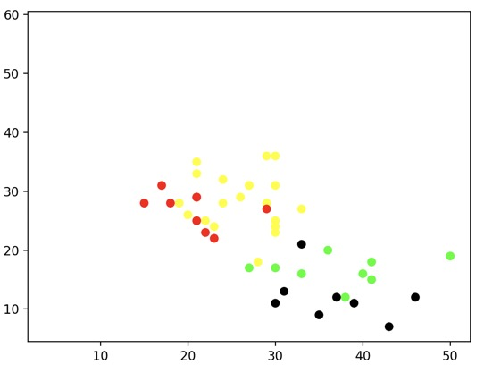

## 2D Arrays for Scatterplots

```py
import matplotlib.pyplot as plt
from sklearn.datasets import make_multilabel_classification

# 4 classes
X, y = make_multilabel_classification(n_samples=100, n_features=2, n_classes=4)
plt.scatter(X[:, 0], X[:, 1], c=y)
plt.show()
```

If `pyplot.scatter()` expects a 1-dimensional array for the `c` argument, then why is it that this actually works?

*I had no idea what the data looks like.  That's why I didn't know.*



This graph will change because it's random.  But the data shape is the same.

X.shape: (100, 2)<br>
y.shape(100, 4)

## Answer:

The code snippet you provided uses the `c` argument in `pyplot.scatter()` to determine the colors of the scatter plot points. The `c` argument can take in many different types of inputs, not just a 1-dimensional array. It can handle different shapes and dimensions as well, including 2-dimensional arrays, which is what is happening in your case.

In the `make_multilabel_classification` function, `y` is a 2D array where each row is a sample and each column corresponds to a class. A cell in this matrix is 1 if the sample belongs to the class and 0 otherwise. This is known as a binary or "one-hot" encoding of the class labels.

When you pass this 2D array to `plt.scatter`, the colors of the markers are determined by mapping `y` onto a color map. The mapping is not straightforward because the `y` is a 2D array, not a 1D array. Matplotlib handles this situation by flattening the array in column-major (Fortran-style) order, then using these values to determine colors.

If you wanted to, for example, color the points by a single class, you could use `c=y[:, i]` where `i` is the index of the desired class. This would indeed be a 1D array, and points would be colored based on whether or not they belong to class `i`.

Remember, the color specification in matplotlib is very flexible. It can be single color format string, a sequence of color specifications of length N, a sequence of N numbers to be mapped to colors using color map and norm, etc. In your case, the `c` argument gets a 2D array and it works fine due to this flexibility.

## 5 classes

`n_classes=5` does not work.

`invalid_shape_exception` that says "ValueError: 'c' argument has 500 elements, which is inconsistent with 'x' and 'y' with size 100."

Fix it like this:

```py
import matplotlib.pyplot as plt
from sklearn.datasets import make_multilabel_classification

X, y = make_multilabel_classification(n_samples=100, n_features=2, n_classes=5)
# plt.scatter(X[:, 0], X[:, 1], c=y)
plt.scatter(X[:, 0], X[:, 1], cmap='viridis')  # Here you go.
plt.show()
```

### 10 features, 5 classes

The `plt.scatter` function expects `c` to be an **array of color values**, with **one value for each point** in the plot.

In your case, `y` is a multi-label classification target with 5 classes, so it has shape `(100, 5)`.

To plot the data with different colors for each class, you can use the <mark>**`np.argmax`**</mark> function to **get the index of the maximum value** for each row of y.

This will give you an **array of integer labels** that you can use as the `c` argument to `plt.scatter`.

Here's how you can modify your code to plot the data:

```python
import matplotlib.pyplot as plt
import numpy as np
from sklearn.datasets import make_multilabel_classification

X, y = make_multilabel_classification(n_samples=100, n_features=10, n_classes=5)
print("y.shape:", y.shape)  # (100, 5)

# get the integer labels
labels = np.argmax(y, axis=1)  # <- numpy
print("labels.shape:", labels.shape)  # (100,)

# plot the data
plt.scatter(X[:, 0], X[:, 1], c=labels)  # <- See?
plt.show()
```

<br>
