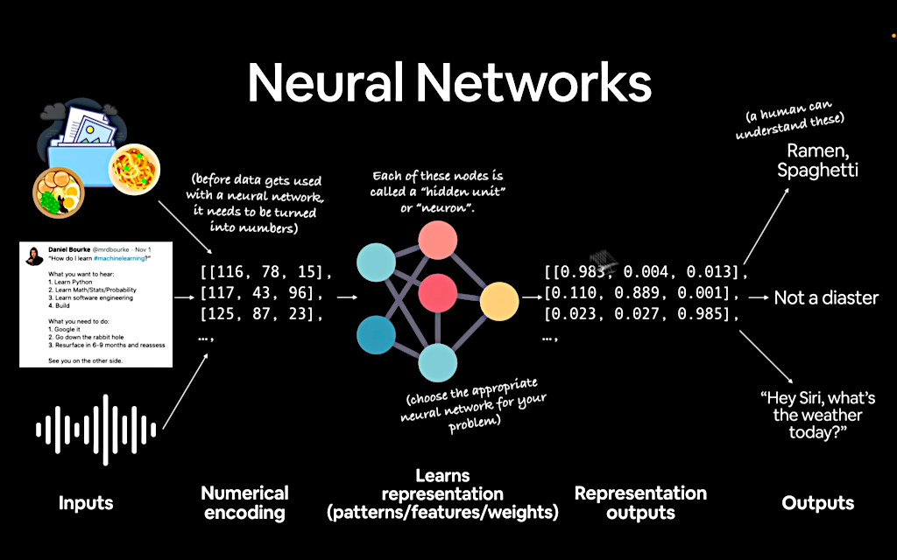

## Machine Learning vs. Deep Learning 

### ML: Structured data

* Random forest 
* Gradient boosted models 
* Naive Bayes 
* Nearest neighbour 
* Support vector machine 
* ...many more

*(Since the advent of deep learning, these are often referred to as "shallow algorithms".)*

### DL: Unstructured data

*(common algorithms)*

* Neural networks
* Fully connected neural network
* Convolutional neural network
* Recurrent neural network
* Transformer
* ...many more 

So the difference is: deep learning is a subset of machine learning.  And you're gonna use *deep* neural networks, with many layers.  Voila.

Yashaswi Kulshreshtha 
I think you can use ML for literally anything; as long as you can convert it into numbers, and program it to find patterns. Literally it could be anything; any input or output from the universe.

 
